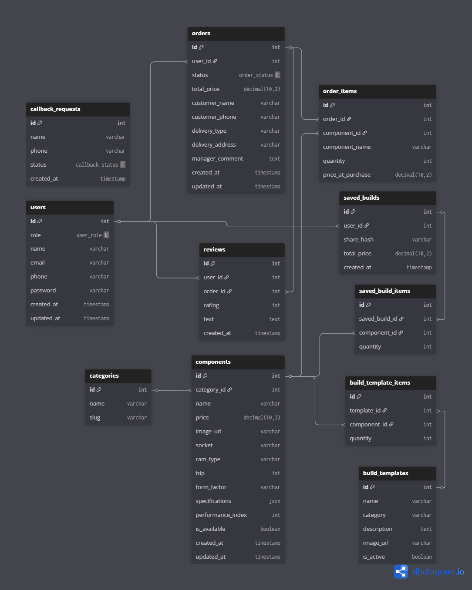

# REST API платформы «PC Lab» — Конструктор и магазин ПК

Проект представляет собой серверную часть (API) для интернет-магазина компьютерных комплектующих и интеллектуального конфигуратора системных блоков. Система поддерживает фильтрацию по совместимости (сокеты, типы памяти), управление заказами и сохранение пользовательских сборок для обмена.

## Технологический стек
* **Язык:** PHP 8.2+
* **Фреймворк:** Laravel 11
* **База данных:** MySQL (XAMPP)
* **Авторизация:** Laravel Sanctum (Token-based)
* **Инструменты:** Postman / Thunder Client

---

## ER-Диаграмма БД

> **Архитектура базы данных:**
> Отражает связи между категориями, техническими характеристиками компонентов, заказами и сохраненными конфигурациями.

---

## Прогресс по чекпоинтам

### Чекпоинт 1: Проектирование и старт
- [x] Выбран стек технологий и настроено окружение (XAMPP).
- [x] Инициализирован проект и Git-репозиторий.
- [x] Спроектирована и реализована база данных (12 таблиц).
- [x] Созданы модели Eloquent и прописаны связи (Relationships).
- [x] Подготовлены сидеры с реальными комплектующими для тестов.
- [x] Спроектирован базовый список эндпоинтов API.

### Чекпоинт 2: Авторизация и управление каталогом
- [x] Реализована регистрация и авторизация (Laravel Sanctum).
- [x] Реализована «умная» фильтрация комплектующих по сокетам и категориям.
- [x] Добавлен функционал сохранения сборок с генерацией уникального хэша.
- [x] Настроена логика подсчета общей стоимости сборки на стороне сервера.
- [x] Настроено хранилище для изображений товаров (`storage:link`).
- [x] Подготовлены расширенные сидеры для актуальных платформ (LGA1700, AM4).

---

## Документация API Эндпоинтов

### 1. Аутентификация
| Метод | Эндпоинт | Описание |
| :--- | :--- | :--- |
| `POST` | `/api/register` | Регистрация нового пользователя |
| `POST` | `/api/login` | Вход и получение Bearer токена |
| `POST` | `/api/logout` | Выход (удаление текущего токена) |

### 2. Каталог комплектующих
| Метод | Эндпоинт | Описание |
| :--- | :--- | :--- |
| `GET` | `/api/components` | Список товаров (фильтры: `category_id`, `socket`, `ram_type`) |
| `GET` | `/api/components/{id}` | Детальные характеристики компонента |

### 3. Конфигуратор сборок
| Метод | Эндпоинт | Описание |
| :--- | :--- | :--- |
| `POST` | `/api/builds` | Сохранение сборки (требуется `Authorization: Bearer`) |
| `GET` | `/api/builds/{hash}` | Получение состава сборки по уникальной ссылке |